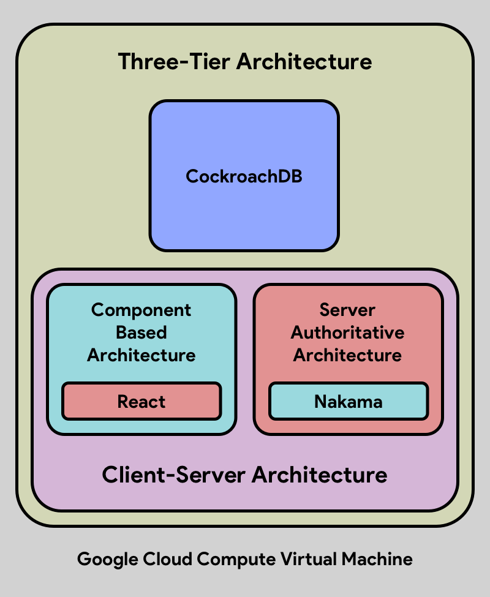

# Tic Tac Toe

This document contains all necessary instructions to set up, test, and deploy the Tic Tac Toe project.

⚠️ **Note:** Testing indicates that network providers with slower speeds may cause disturbances during matchmaking.

---

## ⚙️ Development Environment Setup

Install the following dependencies before running the project locally.

### 1. Docker

Add the official Docker repository to Fedora, install the core engine, CLI, and Compose plugin, then start the background service:

```bash
sudo dnf config-manager addrepo --from-repofile=https://download.docker.com/linux/fedora/docker-ce.repo
sudo dnf install docker-ce docker-ce-cli containerd.io docker-compose-plugin -y
sudo systemctl enable --now docker
```

### 2. Node.js

Install Node.js (LTS recommended) to run the React frontend and manage packages via npm:

```bash
curl -fsSL https://rpm.nodesource.com/setup_lts.x | sudo bash -
sudo dnf install -y nodejs
```

Verify the installation:

```bash
node -v
npm -v
```

> **Note:** Node.js is required to run `npm install` and `npm run dev` in the `client/` directory.

### 3. Nakama

Download the specific v3.38.0 Linux binary, extract it, and move it into your system's executable path so the `nakama` command works globally:

```bash
wget https://github.com/heroiclabs/nakama/releases/download/v3.38.0/nakama-3.38.0-linux-amd64.tar.gz
tar -xvzf nakama-3.38.0-linux-amd64.tar.gz
sudo mv nakama /usr/local/bin/
```

### 4. CockroachDB

Download the v23.2.0 database engine, extract it, and move the executable to your system path:

```bash
curl -O https://binaries.cockroachdb.com/cockroach-v23.2.0.linux-amd64.tgz
tar -xzf cockroach-v23.2.0.linux-amd64.tgz
sudo cp -i cockroach-v23.2.0.linux-amd64/cockroach /usr/local/bin/
```

> **Note:** Ensure a local CockroachDB node is running in the background on port `26257` before starting the backend.

---

## 🛠️ Setup Guide

The following instructions detail the process for local project setup and live server preparation.

### 💻 Step 1: Local Development

Steps to execute the code in a local development environment:

1. **Clone:** Download the repository from GitHub using `git clone https://github.com/iarghadip/tictactoe.git`.
2. **Environment:** Copy the example environment variables file using `cp server/.env.example server/.env`.
3. **Backend:** Open a terminal, navigate to the server folder, and start the Nakama server using `cd server` and `nakama --config nakama-config.yml`. (Ensure a local instance of CockroachDB is running).
4. **Frontend:** Open a new terminal tab, navigate to the client folder, install the required packages, and start the frontend using `cd client`, `npm install`, and `npm run dev`.

### 🐳 Step 2: Build & Testing

Instructions for local build testing via Docker prior to live deployment:

1. **Keys:** Generate and export a secure Nakama key using `export VITE_NAKAMA_KEY=$(node -e "console.log(require('crypto').randomBytes(64).toString('hex'))")`.
2. **Host:** Set the local test host by running `export VITE_NAKAMA_HOST=0.0.0.0.nip.io`.
3. **Email:** Set the email for the SSL certificate using `export CERTBOT_EMAIL=hello@email.com`.
4. **Docker:** Build and start the containers to verify stability using `docker-compose up --build`.

### 🌐 Step 3: Server Configuration Details

The initial server setup required for automated GitHub Actions deployment:

1. **Server:** Create a new Linux VM on Google Cloud (GCP) and install the required tools using `sudo apt-get install docker.io docker-compose nodejs -y`.
2. **Firewall:** Access the GCP network settings and allow HTTP (Port `80`) and HTTPS (Port `443`) traffic to ensure external accessibility.
3. **Access:** Generate an SSH key (`ssh-keygen`), paste the public key into the `authorized_keys` file, and secure the file using `chmod 600 authorized_keys`.
4. **Secrets:** Navigate to the GitHub repository settings and add the following secrets to enable authentication: `DOMAIN`, `EMAIL`, `SERVER_IP`, `SSH_PASSPHRASE`, `SSH_PRIVATE_KEY`, and `SSH_USERNAME`.
5. **Auto-Deploy:** With `.github/deploy.yml` configured, pushing code to the deployment branch will automatically trigger the build and deployment process to GCP.

---

## 🎮 Multiplayer Testing Guide

Guidelines for verifying successful connection and gameplay between participants.

### 🔗 Where to Test

Select the appropriate link based on the testing environment:
* **Development Server (Local):** `http://localhost:3000`
* **Live Server (Production):** `https://136.116.202.164.nip.io`

### 🕹️ Step-by-Step Testing

The matchmaking testing procedure is identical for both local and live servers:

1. **Open the Game:** Access the server link from two distinct devices or two separate web browsers.
2. **Choose Game Mode:** Select either a **Timed Match** or a **Classic Match** on both instances. Enter a username if prompted.
3. **Matchmaking:** Wait for the server to pair the players. Upon completion, both participants will automatically be connected to a single game session.

---

## 🚀 Deployment Process

This section outlines the code progression from the development environment to the live production server.

### 🛠️ Tech Stack
* **Frontend & Backend:** React, Nakama
* **Database:** CockroachDB
* **Code Management:** Git, GitHub
* **Automation:** GitHub Actions
* **Server & Traffic:** GCP Compute, Docker, Nginx

### 💻 Step 1: Development Cycle

The mandatory testing procedure prior to live deployment:

1. **Feature Branch:** All new features must be developed in isolated branches.
2. **Basic Testing:** Unit tests are executed. Upon passing, the code is merged into the `development` branch.
3. **Test:** Prior to a new release, the entire `development` branch undergoes comprehensive testing.
4. **Build:** The project is built locally via Docker to verify build integrity.
5. **Deploy:** The `development` branch is merged into the `production` branch, automatically initiating the final deployment sequence.

### 🌐 Step 2: Deployment Cycle

Upon merging to the `production` branch, GitHub Actions automates the subsequent steps:

1. **Login:** GitHub Actions authenticates with the Google Cloud server (GCP VM) via SSH.
2. **Fetch:** The latest validated code is pulled from the `production` branch.
3. **Build:** Docker initiates the application build and exposes ports `80` and `443` for external communication.
4. **Secure:** Certbot provisions a new SSL certificate to establish a secure connection.
5. **Traffic:** Nginx is configured as a reverse proxy to route public traffic to the application.

---

## 🚀 Architecture

<p align="center">
  
</p>

The project utilizes a **Containerized Three-Tier, Client-Server, Server-Authoritative, Component-Based Architecture**. This ensures the backend server dictates the final game state, maintaining security and preventing unauthorized manipulation.

System design breakdown:

### 📦 Containerized
This deployment model is optimized for execution on a single Virtual Machine (VM). Docker is utilized to isolate the system into three distinct containers:
1. **Presentation Tier:** The React Frontend.
2. **Application Tier:** The Nakama Backend.
3. **Data Tier:** The CockroachDB Database.

This containerized approach guarantees consistent operation across both local development environments and live production servers.

### 🔄 Methodology
The project adheres to Agile principles. The codebase and deployment pipelines are structured to facilitate rapid, continuous delivery of features and fixes without disrupting live services.

### 🧩 Frontend
* **React:** The user interface employs a strict **Component-Based Architecture**, ensuring modularity, reusability, and maintainability.

### ⚙️ Backend
* **Nakama:** The backend operates entirely on the Nakama game server executable, managing real-time multiplayer connections, matchmaking, and user authentication.

### 🗄️ Database
* **CockroachDB:** The system utilizes Nakama's default database, CockroachDB, operating within the Docker environment for secure storage of player data and match records.

---

## 🎨 Design

Overview of the aesthetic, functional, and reward-based design elements.

### 🌍 Platform
The application is entirely web-based and features a responsive design that adapts to varying screen dimensions. It is accessible on mainstream devices without requiring downloads:
* **Mobiles:** iPhone, Android
* **Tablets:** iPad
* **Computers:** Mac, Windows, Linux

### 🏆 Score
A strict scoring system is implemented to maintain player engagement and penalize match abandonment. Ranks are affected as follows:
* **Win:** +75 points
* **Lose:** -25 points
* **Draw:** 0 points

*Note: The deduction of points for a defeat mandates active participation once a match commences.*

### 🎵 Media
To enhance the user experience, the application includes:
* Engaging background music
* Satisfying sound effects for individual actions
* Smooth animations for board interactions